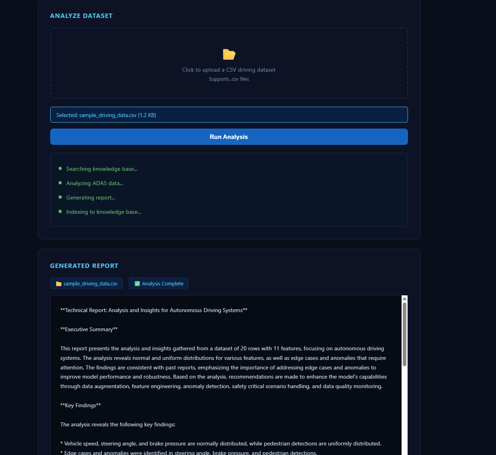
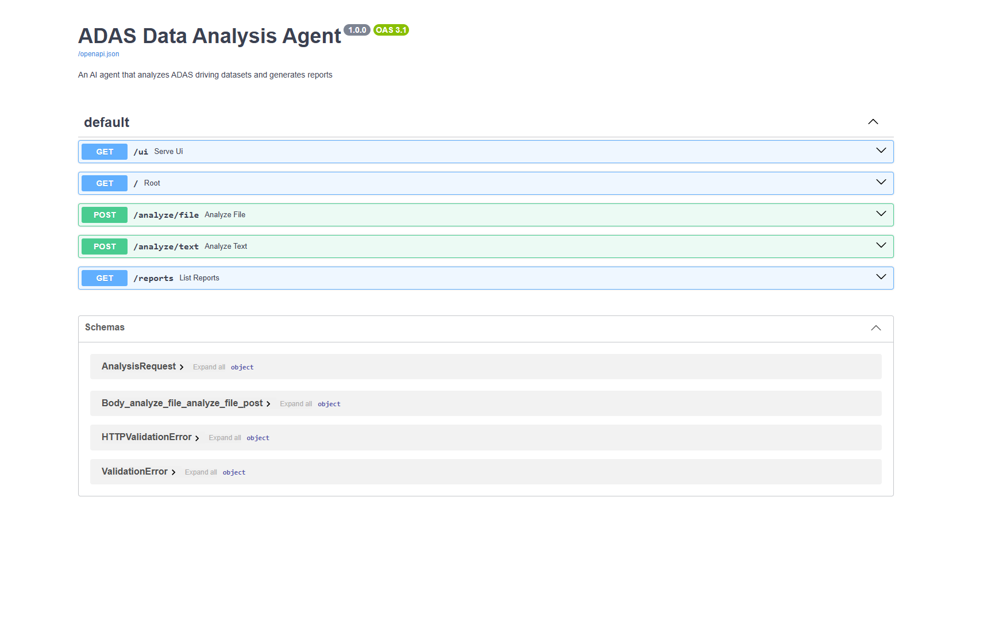

#  ADAS Data Analysis Agent

An AI-powered agent that automatically analyzes autonomous driving datasets, detects edge cases, and generates professional technical reports - powered by a local LLM via Ollama and a RAG pipeline for historical knowledge retrieval.

Built as part of an ADAS/autonomous driving AI portfolio, targeting real industry workflows used at companies like Bosch, Continental, and BMW.

---

## Demo





---

## What It Does

- Uploads and parses CSV driving datasets (speed, steering, brake, object detection, weather, scenarios)
- Detects edge cases and anomalies automatically using statistical analysis
- Runs a 4-step LangGraph agent pipeline — retrieve → analyze → report → index
- Searches past reports using a RAG pipeline (ChromaDB + Sentence Transformers) to enrich analysis with historical context
- Generates structured technical reports with executive summary, findings, and model improvement recommendations
- Saves all reports locally and indexes them back into the knowledge base automatically
- Exposes everything via a FastAPI REST API with interactive Swagger docs
- Clean dark-themed web UI - no setup needed to use

---

## Architecture
CSV Dataset
↓
FastAPI (api/main.py)
↓
LangGraph Agent (agent/core.py)
├── Node 1: Retrieve — RAG search of past reports
├── Node 2: Analyze — LLM analyzes dataset + RAG context
├── Node 3: Report — LLM generates structured report
└── Node 4: Index — new report saved to ChromaDB
↓
Reports saved to /reports + returned via API

---

## Tech Stack

| Layer | Technology |
|---|---|
| Agent Framework | LangGraph + LangChain |
| Local LLM | Ollama (Llama 3.1 8B) |
| RAG Pipeline | ChromaDB + Sentence Transformers |
| API | FastAPI + Uvicorn |
| Data Analysis | Pandas |
| Frontend | HTML + CSS + Vanilla JS |
| Config | Pydantic Settings + dotenv |

---

## Project Structure
adas-data-agent/
├── agent/
│ ├── core.py # LangGraph agent with 4 nodes
│ └── tools.py # Dataset loading and edge case detection
├── rag/
│ ├── pipeline.py # Report indexing and knowledge base queries
│ └── embeddings.py # ChromaDB client and embedding model
├── api/
│ └── main.py # FastAPI endpoints
├── config/
│ └── settings.py # Centralized configuration
├── frontend/
│ └── index.html # Web UI
├── data/
│ └── samples/ # Place your CSV datasets here
├── reports/ # Auto-generated reports saved here
├── screenshots/
└── requirements.txt

---

## Getting Started

### Prerequisites

- Python 3.10 or 3.11
- [Ollama](https://ollama.com/download) installed and running

### 1. Clone the repository

```bash
git clone https://github.com/shaikaltaaf123/adas-data-agent.git
cd adas-data-agent
```

### 2. Create virtual environment

```bash
python -m venv venv
venv\Scripts\activate        # Windows
source venv/bin/activate     # Mac/Linux
```

### 3. Install dependencies

```bash
pip install -r requirements.txt
```

### 4. Pull the LLM model

```bash
ollama pull llama3.1
```

### 5. Set up environment variables

Create a `.env` file in the project root:
OLLAMA_BASE_URL=http://localhost:11434
OLLAMA_MODEL=llama3.1
API_HOST=0.0.0.0
API_PORT=8000

### 6. Start the server

```bash
uvicorn api.main:app --reload --host 0.0.0.0 --port 8000
```

### 7. Open the UI
http://localhost:8000/ui

Upload any CSV driving dataset and click **Run Analysis**.

---

## API Endpoints

| Method | Endpoint | Description |
|---|---|---|
| GET | `/` | Health check |
| GET | `/ui` | Web interface |
| POST | `/analyze/file` | Upload CSV and analyze |
| POST | `/analyze/text` | Analyze from text description |
| GET | `/reports` | List all saved reports |
| GET | `/docs` | Interactive Swagger documentation |

---

## Sample Dataset

A sample ADAS dataset is included at `data/samples/sample_driving_data.csv` with the following features:

- `timestamp` — time in seconds
- `vehicle_speed` — km/h
- `steering_angle` — degrees
- `brake_pressure` — normalized 0–1
- `throttle` — normalized 0–1
- `lane_offset` — meters from lane center
- `object_detected` — pedestrian / car / none
- `object_distance` — meters
- `weather` — clear / rain / fog
- `time_of_day` — day / night
- `scenario` — normal / edge_case / critical

---

## How the RAG Pipeline Works

Every report generated is automatically embedded and stored in a local ChromaDB vector database. On the next analysis, the agent first searches this knowledge base for relevant past reports and includes that context in its reasoning — making each successive analysis smarter and more informed.

---

## Author

**Altaaf Shaik**
GitHub: [@shaikaltaaf123](https://github.com/shaikaltaaf123)